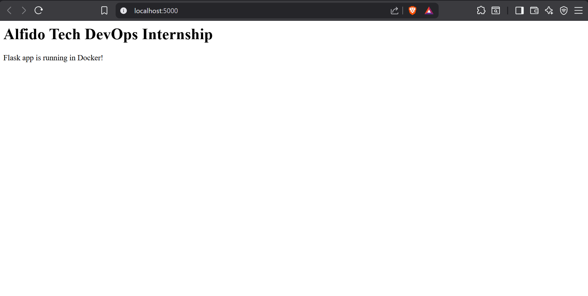

# Task 1 — Dockerize a Python Web App

**Intern:** KVSajith34  
**Internship:** Alfido Tech — DevOps Track  
**Task:** Containerize a Flask web application with PostgreSQL using Docker

---

## Tech Stack

| Component | Tool |
|-----------|------|
| Language | Python 3.11 |
| Framework | Flask |
| Database | PostgreSQL 15 |
| Container | Docker |
| Orchestration | Docker Compose |

---

## Project Structure
task1-docker-webapp/
├── app/
│   ├── app.py
│   └── requirements.txt
├── Dockerfile
├── docker-compose.yml
├── .dockerignore
└── README.md
---

## Features

- Multi-stage Dockerfile (builder + runner)
- Flask app with 3 endpoints
- PostgreSQL database integration
- Docker Compose orchestration

---

## Endpoints

| Route | Description |
|-------|-------------|
| `/` | Homepage |
| `/health` | Health check |
| `/db` | Database connection check |

---

## Build & Run

### Prerequisites
- Docker Desktop
- Docker Compose

### Start Application
```bash
docker compose up --build
```

### Stop Application
```bash
docker compose down
```

---

## Screenshots

### Running Containers


### Endpoints


---

## Commands Reference

```bash
# Build image only
docker build -t flask-app .

# View running containers
docker ps

# View logs
docker logs flask-app

# Stop all containers
docker compose down

# Remove volumes
docker compose down -v
```